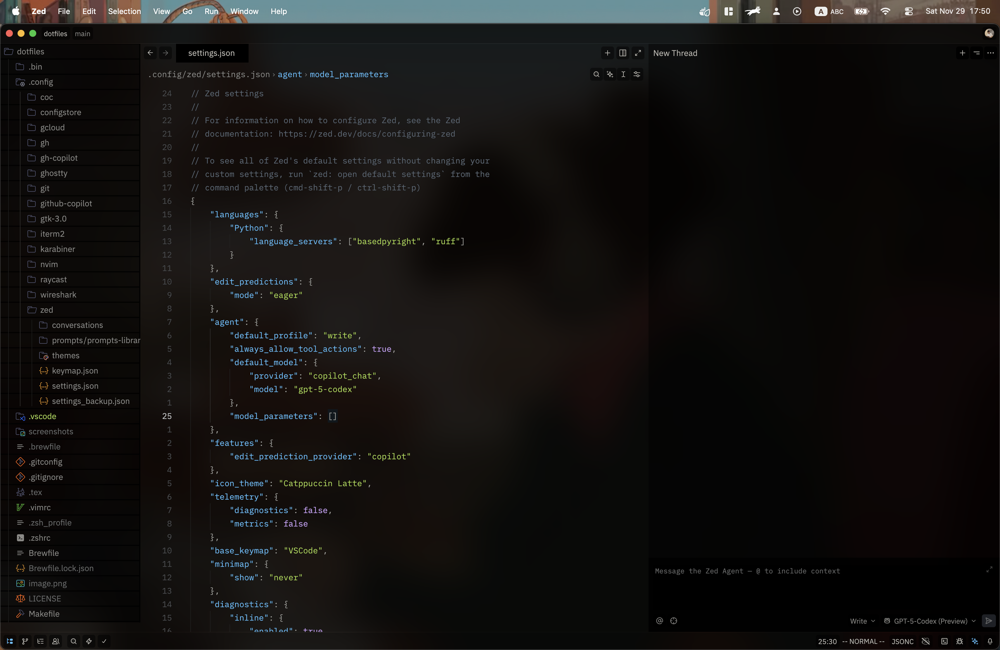
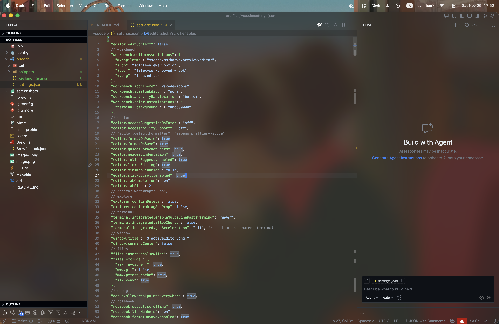

# dotfiles

@okayama-daiki does dotfiles

## Environment

- MacBoor Air M2, 2022 (macOS Tahoe 26)

## Installation

1. Clone this repository

   ```bash
   git clone git@github.com:okayama-daiki/dotfiles.git
   ```

2. Run the installation script

   ```bash
   make all
   ```

## Features

### Package Manager

#### [Homebrew](https://brew.sh) - The missing package manager for macOS and Linux

### Shell

#### [zsh](https://www.zsh.org) - A shell designed for interactive use, although it is also a powerful scripting language

### Editor

#### [Zed](https://zed.dev) - Code at the speed of thought



#### [VSCode](https://code.visualstudio.com) - A lightweight but powerful source code editor which runs on your desktop and is available for Windows, macOS and Linux



### Terminal

#### [Ghostly](https://ghostly.dev) - A beautiful terminal built for productivity

### Others

- [Raycast](https://raycast.com) - The productivity tool for the macOS command line
- [Rectangle](https://rectangleapp.com) - Move and resize windows on macOS using keyboard shortcuts or snap areas
- [RunCat](https://www.runcat.app) - The macOS app that shows your CPU and memory usage in the menu bar
- [AltTab](https://alt-tab-macos.netlify.app) - The app switcher for macOS that works like Windows
- [KeyCastr](https://keycastr.com) - An open source keystroke visualizer for macOS
- [BackDrop](https://backdropapp.io) - The app that automatically changes your wallpaper based on the time of day
- [Karabiner-Elements](https://karabiner-elements.pqrs.org) - The powerful and stable keyboard customizer for macOS
